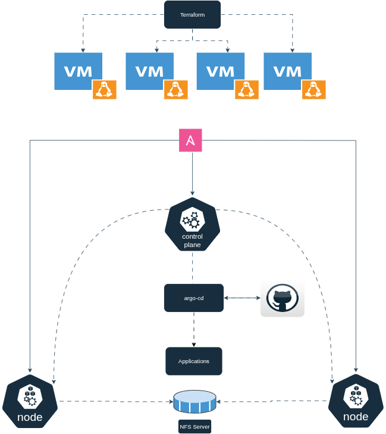

# Kubernetes Homelab (K3s)

[](https://www.terraform.io/)  
[](https://www.ansible.com/)  
[](https://k3s.io/)  
[](https://argo-cd.readthedocs.io/)  
[](https://helm.sh/)


## 📌 Motivation
This project is a **Kubernetes homelab** I built while preparing for the **Certified Kubernetes Administrator (CKA)** certification.  
It uses **Terraform** and **Ansible** to provision and configure a **K3s cluster**, with **Argo CD** and **Helm** handling GitOps-based application deployment.  

A practical playground for **automation**, **GitOps**, and **real-world Kubernetes operations**.

## Requirements

**Note:** Due to limited hardware resources, I configured my environment on a mini PC equipped with 16 GB of RAM and a single CPU with 4 cores.  
This code can be used as a base or starting point to deploy any environment tailored to your business needs.

- Terraform v1 or later  
- Ansible 2.9 or later  
- Any Linux distribution based on Debian
- libvirt and KVM  


## Introduction

This automation provisions and deploys a Kubernetes (K3s) cluster with 3 nodes, along with a dedicated NFS server for shared storage.




## Why do we need both Terraform and Ansible?
* Terraform is designed to provision different infrastructure components.
* Ansible is a configuration-management and application-deployment tool. 
* It means that you’ll use Terraform first to create the virtual machines and then use Ansible to install and set up the kubernetes cluster.

* [TerraformAnsible](https://www.hashicorp.com/resources/ansible-terraform-better-together) - Good page and video explaining why Ansible and HashiCorp are  better together.

##### As a good practice, keep your terraform.tfstate file in a backend - [TerraformBackend](https://developer.hashicorp.com/terraform/language/backend)

## Setup
#### To run this project, perform the command lines:
 ```
#Clone the repository
$ git clone https://github.com/cz75ww/homelab-k3s-deploy.git


# go to terraform folder
$ cd terraform

# Download the Plugs 
$ terraform init

# Rewrite Terraform configuration files to a canonical format and style
$ terraform fmt 

# Make sure if your syntax is correct
$ terraform validate

# See a preview and in case of no issue apply it
$ terraform plan -out k3s.plan
$ terraform apply k3s.plan

# To destroy the environment
$ terraform destroy --auto-approve
```